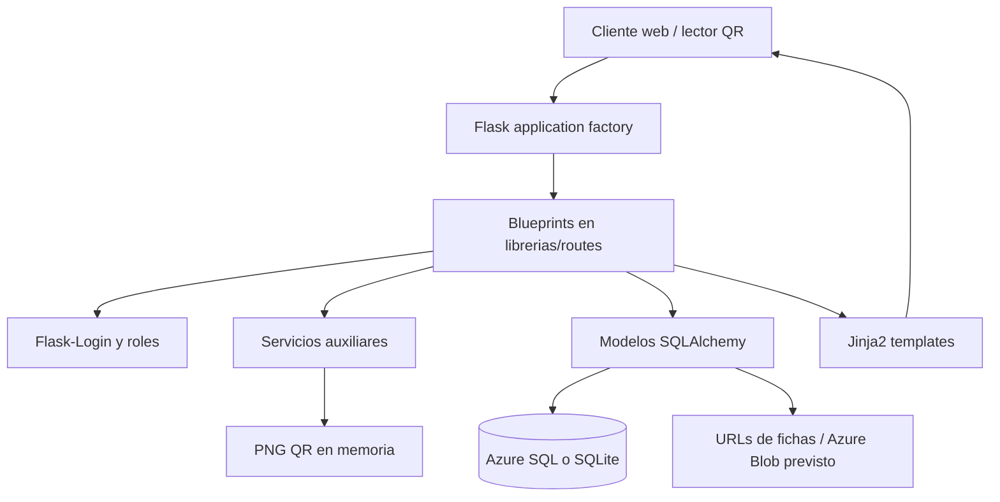

# Arquitectura de MediotecVial

## 1. Propósito del proyecto

MediotecVial es una aplicación web para gestionar hojas de rescate vehicular y códigos QR físicos asociados a vehículos. Un administrador genera lotes de códigos QR para impresión; un cliente activa un código y lo vincula con un vehículo; bomberos, rescatistas o personal de emergencia pueden escanear el código y consultar públicamente la ficha técnica del vehículo, incluidos el tipo de propulsión y las recomendaciones de intervención.

Además del flujo QR, el sistema permite administrar clientes, usuarios, activos, plantillas vehiculares, tipos de combustible y planos/documentos de emergencia.

## 2. Características principales

- Landing pública, preguntas frecuentes, noticias, política de privacidad y términos.
- Registro de clientes con creación transaccional de `User` y `Client`.
- Login/logout con Flask-Login, roles `admin`, `cliente` y `firefighter`, y cambio de contraseña.
- Generación masiva de UUIDs QR en estado `VIRGEN`, filtrado, métricas y exportación CSV para imprenta.
- Router QR: un código virgen lleva a activación y uno activado lleva a la hoja de rescate.
- Activación de vehículos mediante catálogo de marca/modelo/año y tipo de combustible.
- Consulta pública de una ficha de rescate por ID de activo, UUID de QR o dominio/patente.
- Portal de clientes con listado y edición restringida de sus propios activos.
- Administración de clientes, usuarios, activos y plantillas vehiculares.
- Solicitud de incorporación de vehículos ausentes del catálogo.
- Vistas de emergencia y autogestión pública del tipo de combustible.
- Generación de imágenes PNG de QR en memoria.
- Health check para Azure App Service y balanceadores.

## 3. Pila tecnológica

| Capa | Tecnología |
| --- | --- |
| Lenguaje y runtime | Python 3.12 |
| Aplicación web | Flask 3.0, factoría `create_app()` |
| Renderizado | Jinja2 y plantillas HTML; Bootstrap y CSS/JS propios en `static/` |
| ORM y persistencia | Flask-SQLAlchemy 3.1 sobre SQLAlchemy 2.0 |
| Base de datos de producción | Azure SQL Database mediante `pyodbc` y ODBC Driver 17 |
| Base de datos local/pruebas | SQLite, incluida SQLite en memoria para `testing` |
| Sesiones y autenticación | Flask-Login, hashes de contraseña de Werkzeug |
| CORS | Flask-CORS, habilitado para `/api/*` con origen `*` |
| QR | `qrcode` y Pillow |
| Archivos cloud previstos | Azure Storage Blob y `azure-identity` |
| Servidor de despliegue | Gunicorn mediante `wsgi.py` |
| Despliegue documentado | Azure App Service |

`Flask-JWT-Extended` y las claves JWT están en dependencias/configuración, pero los controladores actuales usan sesión/cookie de Flask-Login y no exponen un flujo JWT.

## 4. Estructura y arquitectura

### Entrada y composición

- `app.py` crea la instancia Flask, carga la configuración, inicializa SQLAlchemy, Flask-Login y CORS, registra los Blueprints y configura los manejadores de error.
- `wsgi.py` exporta `app = create_app()` para Gunicorn/Azure App Service.
- Al crear la aplicación se ejecuta `db.create_all()` y `seed_data.run_all_seeds()`. El seed mantiene los ocho tipos oficiales de combustible, el administrador y plantillas de vehículos de ejemplo.
- `app.py` también define alias/wrappers de compatibilidad para `/`, `/home`, `/faq`, `/noticias`, `/actualidad`, `/politicas-privacidad` y `/terminos`. Esas URL también están declaradas en `public.py`; funcionalmente deben considerarse rutas públicas equivalentes.

### Controladores

- `librerias/routes/public.py`: contenido público, health check y ficha de rescate.
- `librerias/routes/auth.py`: autenticación, registro y perfil.
- `librerias/routes/qr_router.py`: decisión de destino del QR y activación.
- `librerias/routes/admin_qr.py`: lotes, métricas, búsqueda y exportación de QRs.
- `librerias/routes/activos.py`: catálogo vehicular, solicitudes y activos del cliente.
- `librerias/routes/admin.py`: back office general, activos, clientes, usuarios, plantillas y planes.
- `librerias/routes/emergency.py`: búsqueda y consulta operativa de emergencia.

### Servicios

`librerias/services/qr_service.py` contiene `generate_qr_image_bytes(data)`. Construye un QR con `qrcode`, lo convierte a PNG con Pillow y lo devuelve como `BytesIO`; `admin.py` y `emergency.py` lo usan para respuestas de descarga. No existe una capa de servicios de dominio separada para clientes, activos o autenticación: esa lógica está actualmente dentro de los controladores.

## 5. Modelo de datos y relaciones

Las entidades definidas en `librerias/models/__init__.py` son:

| Modelo / tabla | Función y relaciones |
| --- | --- |
| `User` / `users` | Credenciales, rol, estado y relación uno a uno con `Client`. |
| `Client` / `clients` | Propietario de activos; enlaza con `User`, `Asset` y solicitudes. |
| `FuelType` / `fuel_type` | Catálogo de ocho tipos oficiales; un tipo puede usarse en muchos activos. |
| `VehicleTemplate` / `Vehicle_templates` | Marca, modelo, año y URL/nombre de la hoja de rescate; se reutiliza en activos. |
| `Asset` / `assets` | Vehículo o activo registrado, dominio, año, combustible y propietario. |
| `CodigoQR` / `CodigoQR` | UUID, lote, estado (`VIRGEN`/`ACTIVADO`) y vínculo opcional con un activo. |
| `SolicitudVehiculoFaltante` / `solicitudes_vehiculo_faltante` | Solicitudes de marcas/modelos ausentes, asociadas opcionalmente a un cliente. |
| `EmergencyPlan` / `emergency_plans` | Documentos/planos vinculados a un activo, con versión y estado activo. |

Relaciones principales: `User 1:1 Client`, `Client 1:N Asset`, `Asset N:1 VehicleTemplate`, `Asset N:1 FuelType`, `Asset 1:1 CodigoQR`, `Client 1:N SolicitudVehiculoFaltante` y `Asset 1:N EmergencyPlan`. Los modelos usan cascadas de SQLAlchemy para clientes/activos y planes, además de claves foráneas declaradas en el esquema DrawDB.

## 6. Flujo de datos principal

### Activación de un QR

1. El lector solicita `GET /qr/<qr_uuid>`.
2. `qr_router.escanear_qr` consulta `CodigoQR`.
3. Si el estado es `VIRGEN`, redirige a `/activacion/<qr_uuid>`; si es `ACTIVADO`, redirige a `/hoja-rescate/<activo_id>`.
4. La activación exige sesión. El formulario consulta `FuelType` y las marcas de `VehicleTemplate`.
5. El POST valida dominio, marca, modelo, combustible y cliente; busca la plantilla compatible.
6. En una misma sesión SQLAlchemy crea `Asset`, hace `flush()` para obtener su ID, asigna `CodigoQR.activo_id`, cambia el estado a `ACTIVADO` y hace `commit()`.

### Consulta de rescate

`public.hoja_rescate` intenta resolver el identificador en este orden: ID numérico de `Asset`, UUID de `CodigoQR` con activo asociado y dominio/patente en mayúsculas. Después obtiene la plantilla y el combustible mediante relaciones ORM, calcula instrucciones de seguridad por tipo de propulsión y renderiza la ficha pública.

### Administración QR

`admin_qr.generar_lote` crea hasta 10.000 objetos `CodigoQR` con UUID v4 y estado `VIRGEN`, usa `bulk_save_objects` y confirma la transacción. Las rutas de métricas/listado consultan `CodigoQR` con joins opcionales a `Asset` y `Client`; la exportación convierte el lote en CSV con las URLs `/qr/<uuid>`.

### Registro y autorización

El registro web y la API llaman a `_procesar_registro_cliente`. La función valida campos y unicidad, crea el `User`, ejecuta `flush()` para obtener su ID, crea el `Client` y confirma ambos. Las rutas de administración usan `login_required` más `admin_required`; la edición de activos de cliente comprueba explícitamente que `asset.client_id == current_user.client.id`.

## 7. Inventario completo de endpoints

### 7.1 Público: `public.py` y aliases de `app.py`

| Método y ruta | Controlador | Comportamiento y persistencia |
| --- | --- | --- |
| `GET /` | `public.index` (también wrapper `app.index`) | Redirige a dashboard admin o activos del cliente si hay sesión; si no, renderiza landing. |
| `GET /home` | `public.home` / `app.mediotec_home` | Landing pública. |
| `GET /faq` | `public.faq` / `app.faq` | Preguntas frecuentes. |
| `GET /actualidad`, `GET /noticias` | `public.actualidad` / wrapper `app.noticias` | Noticias y novedades; ambas URLs renderizan la misma vista. |
| `GET /hoja-rescate/<uid>` | `public.hoja_rescate` | Busca `Asset`/`CodigoQR`, obtiene `VehicleTemplate` y `FuelType`, calcula riesgos y renderiza la ficha. 404 si no existe. |
| `GET /politicas-privacidad` | `public.politicas_privacidad` / `app.privacy_policy` | Política de privacidad. |
| `GET /terminos` | `public.terminos` / `app.terms_of_service` | Términos y condiciones. |
| `GET /health` | `public.health` | JSON de estado, versión y timestamp; no consulta la base de datos. |

### 7.2 Autenticación y cuentas: `auth.py`

Todas las rutas siguientes usan sesión de Flask-Login; `/logout`, `/perfil` y cambio de contraseña requieren login.

| Método y ruta | Controlador | Comportamiento y persistencia |
| --- | --- | --- |
| `GET`, `POST /login` | `auth.login` | Busca `User` por username o email, verifica el hash y crea sesión; redirige por rol o por `next`. Consulta `users`. |
| `GET`, `POST /logout` | `auth.logout` | Cierra la sesión y redirige a `/`. No modifica tablas. |
| `GET`, `POST /registro` | `auth.registro` | Formulario web; llama al registro unificado, crea `User` + `Client`, inicia sesión y redirige. |
| `POST /api/clientes/registro` | `auth.api_registro_cliente` | Acepta JSON o form-data; llama a `_procesar_registro_cliente` y devuelve JSON 201/400. Escribe `users` y `clients`. |
| `GET /perfil` | `auth.profile` | Renderiza el perfil del usuario autenticado. |
| `GET`, `POST /perfil/cambiar-password` | `auth.change_password` | Verifica contraseña actual, valida la nueva, actualiza `User.password_hash` y confirma. |

### 7.3 Router y activación QR: `qr_router.py`

| Método y ruta | Controlador | Comportamiento y persistencia |
| --- | --- | --- |
| `GET /qr/<qr_uuid>` | `qr_router.escanear_qr` | Consulta `CodigoQR`; 404 si falta, redirección a activación si `VIRGEN` y a ficha pública si `ACTIVADO` con `activo_id`. |
| `GET`, `POST /activacion/<qr_uuid>` | `qr_router.activar_qr` | Valida QR y sesión; carga catálogos; en POST crea `Asset`, enlaza `CodigoQR` y cambia su estado dentro de una transacción. |

### 7.4 Catálogo y portal de cliente: `activos.py`

| Método y ruta | Controlador | Comportamiento y persistencia |
| --- | --- | --- |
| `GET /api/vehiculos/marcas` | `activos.api_marcas` | `VehicleTemplate.get_distinct_brands`; devuelve marcas JSON. |
| `GET /api/vehiculos/modelos` | `activos.api_modelos` | Requiere `brand`; consulta modelos distintos mediante `VehicleTemplate`. |
| `GET /api/vehiculos/anios` | `activos.api_anios` | Requiere `brand` y `model`; consulta años distintos mediante `VehicleTemplate`. |
| `POST /api/vehiculos/solicitud-faltante` | `activos.api_solicitar_vehiculo_faltante` | Acepta JSON/form-data, asocia el cliente autenticado si existe y crea `SolicitudVehiculoFaltante` con estado `PENDIENTE`. |
| `GET /cliente/activos` | `activos.mis_activos` | Requiere login; filtra `Asset` por el `Client` de la sesión. Un admin se redirige al listado administrativo. |
| `GET`, `POST /cliente/activos/<asset_id>/editar` | `activos.editar_mi_activo` | Requiere login y autorización por propietario; actualiza combustible, año y descripción de `Asset`. Admin puede editar cualquier activo. |

### 7.5 Administración general: `admin.py`

Todas las rutas de esta sección requieren `login_required` y `admin_required`, y usan formularios HTML salvo donde se indique lo contrario.

| Método y ruta | Controlador | Comportamiento y persistencia |
| --- | --- | --- |
| `GET /admin/dashboard` | `admin.dashboard` | Cuenta usuarios, clientes, activos, plantillas y estados QR; renderiza métricas. |
| `GET /admin/clientes` | `admin.list_clients` | Lista `Client` paginado. |
| `GET`, `POST /admin/clientes/crear` | `admin.create_client` | Muestra formulario y crea `Client`; puede crear automáticamente un `User` cliente con contraseña inicial `cambiar123`. |
| `GET`, `POST /admin/clientes/<client_id>/editar` | `admin.edit_client` | Actualiza datos de `Client`. |
| `GET /admin/usuarios` | `admin.list_users` | Lista `User` paginado. |
| `GET`, `POST /admin/usuarios/crear` | `admin.create_user` | Crea usuario y almacena contraseña hasheada. |
| `GET`, `POST /admin/usuarios/<user_id>/editar` | `admin.edit_user` | Modifica email, rol, activo y opcionalmente contraseña. |
| `POST /admin/usuarios/<user_id>/eliminar` | `admin.delete_user` | Elimina un usuario salvo la propia cuenta del administrador. |
| `GET /admin/activos` | `admin.list_assets` | Lista `Asset` paginado, opcionalmente filtrado por `client_id`. |
| `GET`, `POST /admin/activos/crear` | `admin.create_asset` | Carga catálogos y crea un `Asset`, validando cliente, nombre y dominio único. |
| `GET`, `POST /admin/activos/<asset_id>/editar` | `admin.edit_asset` | Actualiza propietario, datos del activo, plantilla, combustible y dominio único. |
| `GET /admin/vehicle_templates` | `admin.list_vehicle_templates` | Lista el catálogo `VehicleTemplate`. |
| `POST /admin/vehicle_templates/crear` | `admin.create_vehicle_template` | Inserta marca, modelo, año y URL de hoja de rescate. |
| `POST /admin/vehicle_templates/<template_id>/editar` | `admin.edit_vehicle_template` | Actualiza una plantilla. |
| `POST /admin/vehicle_templates/<template_id>/actualizar` | `admin.update_vehicle_template` | Alias que delega en `edit_vehicle_template`. |
| `POST /admin/vehicle_templates/<template_id>/eliminar` | `admin.delete_vehicle_template` | Elimina si no tiene activos asociados. |
| `GET /admin/activos/<asset_id>/qr_autogestion` | `admin.download_qr_autogestion` | Consulta el activo, genera PNG con `qr_service` y lo descarga. No persiste el PNG. |
| `GET /admin/activos/<asset_id>/obleas` | `admin.asset_obleas` | Renderiza la pantalla de impresión con URL pública de la hoja. |
| `GET /admin/activos/<asset_id>/planes` | `admin.list_plans` | Lista `EmergencyPlan` del activo, paginado. |
| `GET`, `POST /admin/activos/<asset_id>/planes/subir` | `admin.upload_plan` | Crea metadatos `EmergencyPlan` desde el formulario y guarda nombre/ruta; el código actual no sube el contenido a Azure Blob. |
| `GET /admin/planes/<plan_id>/qr` | `admin.download_qr` | Genera y descarga un PNG cuyo destino es la hoja pública del activo del plan. |
| `POST /admin/planes/<plan_id>/eliminar` | `admin.delete_plan` | Elimina el `EmergencyPlan` y vuelve al listado del activo. |

### 7.6 Administración de lotes QR: `admin_qr.py`

Estas rutas usan el mismo control administrativo y el prefijo `/admin/qr`.

| Método y ruta | Controlador | Comportamiento y persistencia |
| --- | --- | --- |
| `GET /admin/qr/gestion` | `admin_qr.gestion_qrs` | Consulta métricas, aplica filtros/joins con activos y clientes y renderiza la gestión paginada. |
| `POST /admin/qr/generar` | `admin_qr.generar_lote` | Acepta JSON o form-data; genera de 1 a 10.000 `CodigoQR` vírgenes y devuelve JSON 201 o redirección HTML. |
| `GET /admin/qr/estado` | `admin_qr.estado_metricas` | Devuelve conteos de QRs, lotes y timestamp en JSON. |
| `GET /admin/qr/listar` | `admin_qr.listar_qrs` | Devuelve listado JSON paginado y filtrable, incluyendo URL, estado, lote y datos del activo/cliente. |
| `GET /admin/qr/exportar/<lote>` | `admin_qr.exportar_lote_csv` | Lee todos los QRs del lote y genera un CSV separado por `;` para la imprenta. |

### 7.7 Operación de emergencia: `emergency.py`

Estas rutas no llevan `login_required` y, por tanto, son públicas en el código actual.

| Método y ruta | Controlador | Comportamiento y persistencia |
| --- | --- | --- |
| `GET /emergency/dashboard` | `emergency.dashboard` | Lista todos los activos ordenados por nombre. |
| `GET /emergency/search` | `emergency.search` | Busca activos por nombre, dominio o dirección/modelo con `ilike`. |
| `GET /emergency/asset/<asset_id>` | `emergency.view_asset` | Muestra un activo y sus planes activos. |
| `GET /emergency/asset/<asset_id>/hoja-rescate` | `emergency.view_vehicle_rescue_sheet` | Obtiene plantilla y URL de hoja de rescate; detecta PDF o imagen. |
| `GET /emergency/asset/<asset_id>/qr` | `emergency.download_vehicle_rescue_sheet_qr` | Genera PNG QR en memoria apuntando a `/hoja-rescate/<asset_id>`. |
| `GET /emergency/plan/<plan_id>` | `emergency.view_plan` | Carga un `EmergencyPlan` y su activo, y renderiza el documento. |
| `GET`, `POST /emergency/asset/<asset_id>/autogestion` | `emergency.public_autogestion` | Valida dominio y DNI/CUIT del propietario; si coinciden, muestra el formulario de actualización. |
| `POST /emergency/asset/<asset_id>/autogestion/update` | `emergency.public_autogestion_update` | Busca el combustible, actualiza `Asset.fuel_type_id` y redirige a la ficha pública. |

## 8. Errores y configuración transversal

- `app.py` devuelve plantillas específicas para 404, 403, 500 y errores de SQLAlchemy (`OperationalError`, `InterfaceError`, `DatabaseError`).
- La configuración selecciona `development`, `production` o `testing` mediante `FLASK_ENV`; si no hay ODBC local y no se ejecuta en Azure, usa SQLite.
- Las sesiones duran 24 horas; en producción se marca la cookie como segura, HTTP-only y SameSite `Lax`.
- El límite de carga configurado es 50 MB y se declaran extensiones PDF/imagen, aunque el endpoint de planes actual solo persiste metadatos.
- El seed se ejecuta al iniciar la aplicación, por lo que el arranque tiene efectos de escritura en la base de datos.

## 9. Observaciones de implementación

- La documentación de configuración contempla Azure Blob Storage, pero los controladores de planes no invocan `azure-storage-blob`; `file_path` recibe actualmente el nombre enviado por el formulario.
- La aplicación usa `db.create_all()` en el arranque y no incluye un sistema de migraciones visible.
- `admin_required` está implementado por separado en `admin.py` y `admin_qr.py`.
- Los endpoints `/api/*` tienen CORS abierto a cualquier origen y no usan JWT; el registro y las solicitudes de catálogo son accesibles sin autenticación.
- La ficha `/hoja-rescate/<uid>` y todo el grupo `/emergency/*` están diseñados como consultas públicas de emergencia. Esta decisión permite el acceso inmediato en un siniestro, pero implica que los datos expuestos deben considerarse deliberadamente públicos.
